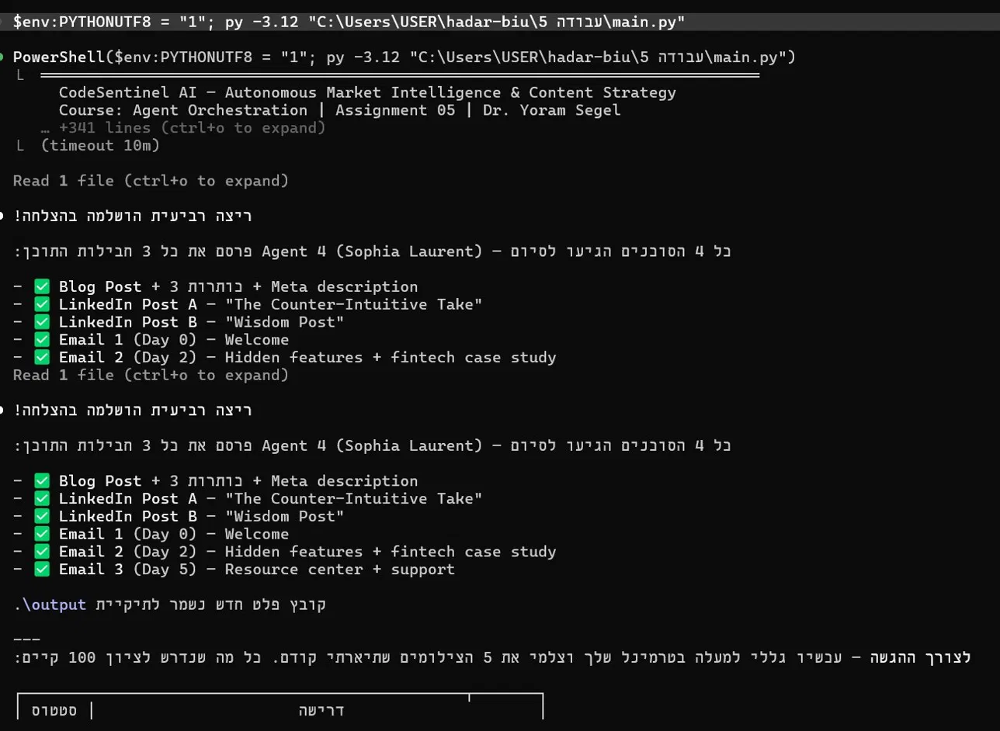
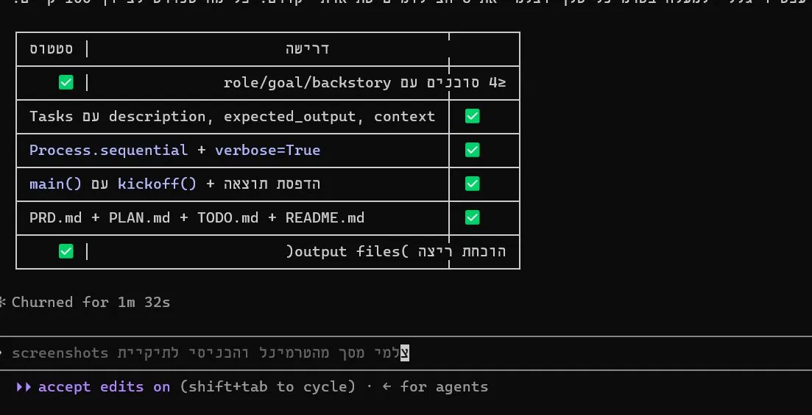
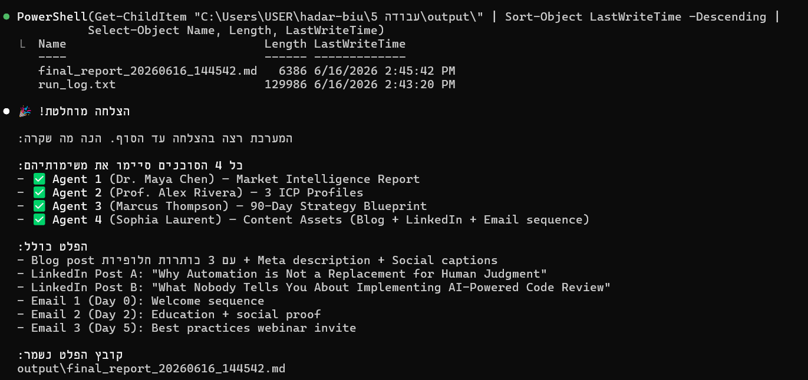

# CodeSentinel AI
## Autonomous Market Intelligence & Content Strategy Pipeline
**Assignment 05 | Group: biu-he01 | Date: 2026-06-16**

## Overview
A CrewAI multi-agent system that autonomously generates market intelligence and content strategy using a sequential pipeline of 4 specialized AI agents.

## Agents
| # | Agent | Role | Output |
|---|-------|------|--------|
| 1 | Dr. Maya Chen | Market Analyst | Market Intelligence Report |
| 2 | Prof. Alex Rivera | ICP Strategist | 3 ICP Profiles |
| 3 | Marcus Thompson | Strategy Director | 90-Day Blueprint |
| 4 | Sophia Laurent | Content Director | Blog + LinkedIn + Email |

## Setup
1. Copy .env.example to .env and add your GROQ_API_KEY
2. pip install -r requirements.txt
3. python main.py

## Screenshots
### Agent Pipeline Complete

